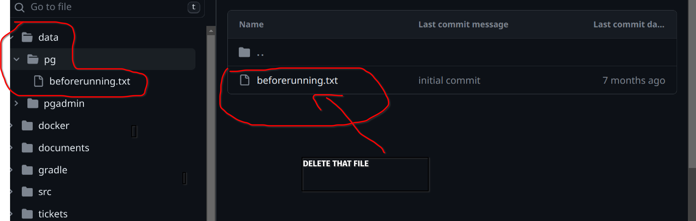

# Bloom Code Camp LMS

## Welcome to the Backend Repository for Bloom Code Camp LMS, an assignment review app!
To set this project up you will need to clone it to your local computer and make sure to have the prereqiosites of...
- docker / dockerdesktop
- docker compose
- intellij Idea
- Java JRE and JDK 17+

### Make sure you are in the root directory...
1. You will need to delete a text file inside the data/pg folder.
 
2. Read the `docker-compose.yml` file and change any ports that you need to based on your local setup
3. Run `docker-compose up`
4. Open the project inside intellij
5. Go to the `application.properties` file and follow the instructions to make your dev profile.
6. look over the code base and familiarize yourself with [spring boot docs](https://docs.spring.io/spring-boot/docs/current/reference/htmlsingle/). 
3. Run the `BackendApplication`
4. Visit `http://localhost:8080/` or localhost at a port you chose if you changed any ports in the `application-dev.properties` file.

**To get an overview of the actual application proposal you can find the docs [here](documents/composition_document.md)**
